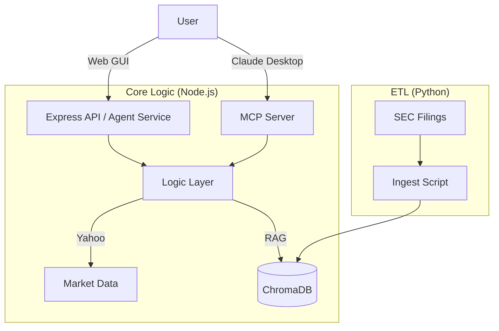

# Financial Pandora 📊🐼


**Financial Pandora** is a hybrid and autonomous **Financial Artificial Intelligence** ecosystem. It combines the power of Large Language Models (LLMs) with real-time market data and deep analysis of regulatory documents (SEC 10-K).

Unlike a traditional chat, Pandora utilizes **Autonomous Agents** capable of reasoning, deciding which tool to use (vector search, stock quotes, or news), and executing complex tasks. Additionally, it implements the **Model Context Protocol (MCP)**, allowing native integration with assistants like Claude Desktop.

---

## ✨ Key Features

*   **🧠 RAG (Retrieval-Augmented Generation):** "Long-term memory" that allows consulting and citing private financial documents (PDFs) stored locally.
*   **🤖 Autonomous Agents:** The system doesn't just respond; it **reasons**. It breaks down complex questions into steps ("Search price" -> "Search news" -> "Analyze correlation").
*   **🔌 MCP Support (Model Context Protocol):** Exposes its tools as a standard MCP server, allowing Claude Desktop to use your local logic.
*   **📈 Real-Time Data:** Integration with Yahoo Finance for quotes, history, and news.
*   **💻 Dual Interface:** 
    *   **Web Dashboard:** Modern UI in React + Shadcn for chart visualization and chat with thought process traceability.
    *   **CLI/MCP:** Interface for developers and connection with other LLMs.

---

## 🏗️ Architecture

The system is divided into three main decoupled modules:



*   **`src_node/`**: The system's brain. Contains the business logic, HTTP server (Express), and MCP server.
*   **`src_gui/`**: The frontend. A SPA built with Vite and React.
*   **`etl_python/`**: The data pipeline. Scripts to download and ingest documents into the vector database.
*   **`data/`**: Local persistence (SQLite and ChromaDB).

---

## 🚀 Installation and Setup

### Prerequisites
*   Node.js (v18+)
*   Python (v3.10+)
*   Google Gemini API Key (or the model you are using).

### 1. Clone the repository
```bash
git clone https://github.com/your-username/financial-pandora.git
cd financial-pandora
```

### 2. Setup Backend (Node.js)
```bash
cd src_node
npm install
# Create a .env file with your API Key
echo "GOOGLE_API_KEY=your_key_here" > .env
cd ..
```

### 3. Setup Frontend (React)
```bash
cd src_gui
npm install
cd ..
```

### 4. Setup ETL (Python)
```bash
cd etl_python
pip install -r requirements.txt
cd ..
```

---

## 🏃‍♂️ Execution

To run the full system, you will need multiple terminals:

### Terminal 1: Vector Database (Chroma)
Starts the database where documents reside.
```bash
chroma run --path data/vector_store
```

### Terminal 2: Backend Server (API + Agent)
Starts the API that feeds the frontend.
```bash
cd src_node
npx tsx server_http.ts
```

### Terminal 3: Frontend (Web GUI)
Starts the user interface.
```bash
cd src_gui
npm run dev
```
Access **http://localhost:5173** in your browser.

---

## 📚 Data Ingestion (Optional)

If you wish to add new documents (PDFs) to the AI's knowledge:

1. Place your PDFs in `data/raw_pdfs/`.
2. Run the ingestion script:
```bash
cd etl_python
python ingest.py
```